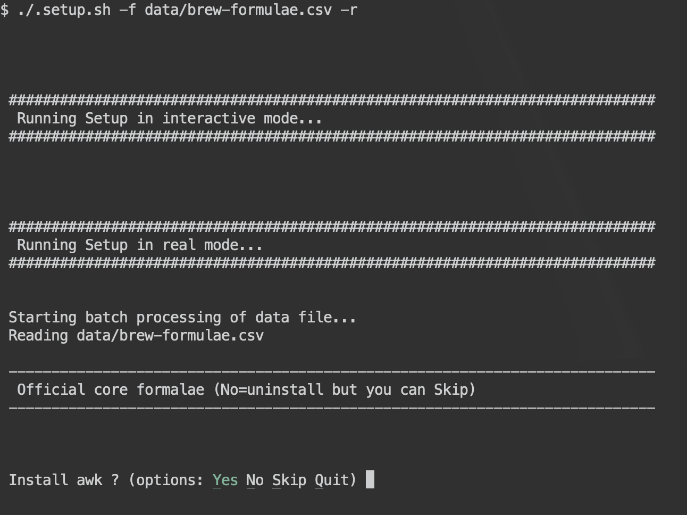

# Automated Desktop Setup

## What

A script that allows to configure any new macOS and/or Linux desktops in a blink of an eye. It is configured via csv files (script can run different sets of data) and shell scripts for basic installation and cloning of repos.

When passing a csv file (with the structure defined below), user is prompted for confirmation on each step.

For security reasons, and mainly to check the csv will work properly, **the script runs in dryrun (fake) mode by default**.



## Why

Everytime I use a computer for the first time, I spend some hours setting up all the options. This script will now allow me to be up and running in a few minutes. 

## Preparation

From a new computer without developer tools, git, ... first thing to do is download this repo as a zip and uncompress the file. Then change the data files at your will. Structure of these files is explained below.

### Warning 

If you want to give this script a try, review the code before running it, change or remove things you don’t want or need. You should just need to update the csv/txt files, as described below. The script _per se_ don't run anything on your computer without data from those csv files. In any case, if you want to use my settings without changing, **USE AT YOUR OWN RISK!**

## Installation using shell scripts

The idea behind the batch script and csv files is that you only have to configure data files, and can have as many as you want without having to edit the script. But core dependencies are installed using shell scripts, without prompting Yes/No at each step.

In my case, I run the scripts in this order (better restart Terminal after each of them):

1. Install [Homebrew](https://brew.sh/) and basic tools (bash, git, ansible).
2. Download and install dotfiles
3. Install nvm and node
4. Install neovim and LSP
5. Create personal and work folders and clone repos into them.


Note: if you are using an ARM64 mac (M1, M1 Pro, M1 Max, ...) you will read some articles saying you have to enable Rosetta for Terminal. This is no longer true, homebrew has native support for ARM mac chips.

### Install Homebrew and basic tools

We will first open the terminal and force the use of `bash`:

```bash
chsh -s /bin/bash
```

Then, close and open Terminal again. Now we can safely run the `.core-install` script to install Homebrew and some core dependencies. Homebrew is the best way so far to install all development dependencies, other software and even fonts:

```bash
./.core-install
```

Do not close the Terminal yet. Now `brew` and the basic tools should be installed properly. Just check with:

```bash
brew doctor
```

To make sure we are using the correct version of bash, you can run:

```bash
which bash
```

It should return something like `/opt/homebrew/bin/bash`. Similarly for `git`.

### Download and install dotfiles

The strategy will depend on the way you actually backup your dotfiles. In my case, I clone my [dotfiles](https://github.com/zigotica/tilde/) as a [bare repo](https://www.atlassian.com/git/tutorials/dotfiles) because I don't like the symlinks approach.

You can run the script below:

```bash
./.dotfiles
```


### Install nvm and node

```bash
./.node

```


### Install neovim and LSP

```bash
./.nvim

```

### Clone repos

I am also using a script to create personal and work folders and clone repos into them:

```bash
./.repos
```
## Installation using csv files

From this point on, main `.setup.sh` script will read csv files and prompt the user for confirmation at each step.

In my case, I am using:

1. Install formulae using `data/brew-formulae.csv`.
2. Install casks using `data/brew-casks.csv`.
3. Install fonts using `data/brew-fonts.csv`.
4. Configure macOS defaults, using `data/defaults-macos.csv`.
5. Enjoy!

### Structure of a CSV file

CSV files contain comments and commands, in the following structure:

* What: describes the content of the line, so the script know what to do with it. Possible values are:
    * `#` Big title
    * `##` Smaller title
    * `b` Brew formula
    * `k` Brew cask
    * `c` Command
    * `d` macOS defaults
    * `r` Run command without asking
* Text: used as title or the question prompted to the user, or the name of the brew formula/cask
* Default answer: boolean (true|false) defines the default action when user replies with Enter (or in silent mode)
* Defaults rule or Command to be run for 'Yes' reply
* Command to be run for 'No' reply

Each line MUST contain 5 columns separated by comma. If first column doesn't include one of the keycodes described above, it will just be skipped.

### Required / Optional arguments

Main `.setup.sh` script needs a csv file passed with a `-f` argument:

```bash
./.setup.sh -f data/brew-formulae.csv
```

The script will run the csv parser automagically.

You can also pass a `-s` optional argument, that will run the whole set of commands without prompting the user for confirmation.

Reminder, for security reasons, and mainly to check the csv/txt will work properly, **the script runs in dryrun (fake) mode by default**. To make it work for real you MUST pass the `-r` argument.


### Install Homebrew formulae, casks and fonts

The script will prompt giving you some options on each step (you can run without prompts if using `-s` argument) to install the core formulae (note the `-r` argument to run it for real):

```bash
./.setup.sh -f data/brew-formulae.csv -r
```

You can then optionally install casks:

```bash
./.setup.sh -f data/brew-casks.csv -r
```

and/or fonts:

```bash
./.setup.sh -f data/brew-fonts.csv -r
```

### Sensible macOS defaults

For a new Mac, next step would be setting some sensible macOS defaults (note the `-r` argument to run it for real):

```bash
./.setup.sh -f data/defaults-macos.csv -r
```

The script will prompt giving you some options on each step (you can run without prompts if using `-s` argument).


With all these, you should be ready to go and enjoy your new computer.

## Feedback

[Issue reports](https://github.com/zigotica/automated-desktop-setup/issues) and [suggestions](https://github.com/zigotica/automated-desktop-setup/pulls) are welcome. Thank you.

## Credits

Big thanx to [Mathias Bynens](https://github.com/mathiasbynens/dotfiles/) and [thoughtbot, inc](https://github.com/thoughtbot/laptop/) for their .dotfiles projects. Also [Luke Smith](https://github.com/LukeSmithxyz/LARBS) for the idea of running a set of commands by reading from a csv file.
